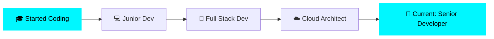

<h1 align="center">
  
</h1>

  
  

---

### 👋 Hey there! I'm DevX2

🎯 **Full Stack Developer** passionate about crafting exceptional digital experiences

🔭 Currently working on **AI-powered web applications**

🌱 Learning **Rust** and **Advanced System Design**

💬 Ask me about **React, Node.js, Cloud Architecture**

⚡ Fun fact: **I turn coffee into code** ☕ → 💻

📍 Based in **Thailand 🇹🇭**

 

---

## 🎨 Tech Arsenal

<b>💻 Languages</b>

 

<b>🎨 Frontend</b>

 

<b>⚙️ Backend</b>

 

<b>☁️ DevOps & Cloud</b>

 

<b>🗄️ Databases</b>

 

---

## 📊 GitHub Statistics

  
  

  

  
  

---

## 🚀 Featured Projects

<table>
<tr>
<td width="50%">

### 🎯 Project Alpha
A revolutionary web application built with cutting-edge technologies
  
**Tech Stack:** React • Node.js • PostgreSQL
 

</td>
<td width="50%">

### ⚡ Project Beta  
High-performance microservices architecture
  
**Tech Stack:** Go • Docker • Kubernetes
 

</td>
</tr>
</table>

---

## 💼 Professional Journey

---

## 📈 Coding Activity

<!--START_SECTION:waka-->
<!--END_SECTION:waka-->

  
**🌟 "Code is poetry written in logic" 🌟**

---

## 🤝 Let's Connect!

 

---

### 💡 Random Dev Quote

---

**⭐ From [DevX2](https://github.com/Devx2) with 💙**

### Thanks for visiting! Let's build something amazing together! 🚀

